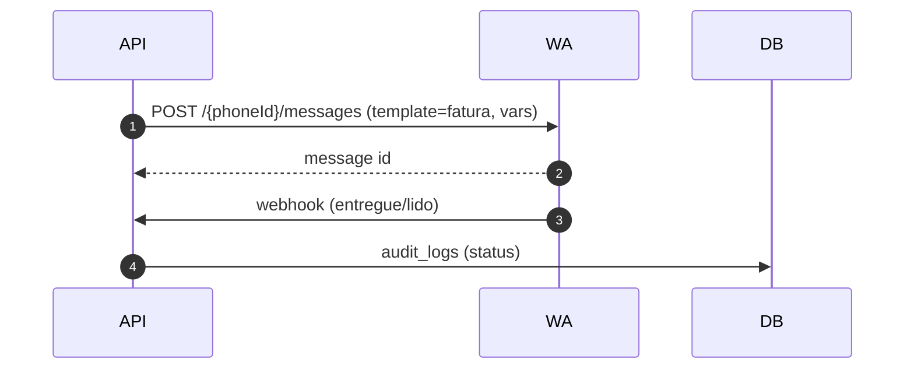

# README.md — Cupcode Cha\$hier (Supabase‑first)

> **Objetivo:** guia único para devs continuarem o Cha\$hier sem Docker, usando **Supabase** (Postgres/Auth/Storage/Edge Functions) + **Next.js 14**. Mantém contratos de adapters (pagamentos/WhatsApp), LGPD e o **Finance Super Admin** (double‑entry) intactos.

---

## 1) Stack & Princípios

* **Frontend:** Next.js 14 (App Router), React 18, TS, Tailwind, shadcn/ui, RHF+Zod, TanStack Query.
* **Backend:** API routes/Server Actions/Edge Functions (Deno) — sem Docker.
* **Dados:** Supabase Postgres (RLS ON), Storage, Auth (recomendado), pg\_cron, pg\_net; filas com **pg-boss**.
* **Segurança:** RBAC (roles: super\_admin, finance, support, client), 2FA TOTP, rate limit, Helmet/CORS, criptografia de campo (AES‑256‑GCM) para segredos, LGPD (PII 5 anos; audit 10 anos).
* **Observabilidade:** Sentry, OpenTelemetry onde aplicável.

**Timezone app:** `America/Sao_Paulo` (armazenar UTC, exibir BRT).

---

## 2) Estrutura do monorepo

```
/                       
  apps/
    web/               # Next.js (Admin + Portal do Cliente)
    api/               # Rotas /api e serviços server‑side
  packages/
    core/              # tipos, modelos, validadores (Zod)
    ui/                # componentes shadcn/ui
    adapters/          # interfaces + adapters (pagto/notificação/fila)
  supabase/
    migrations/        # SQL geradas com supabase db diff
    seed/              # seed SQL/TS (idempotente)
    policies/          # RLS (SQL)
    functions/         # Edge Functions (Deno)
  docs/
    openapi.yaml       # OpenAPI 3.1
    architecture.md    # ERD + Diagramas de sequência + decisões
  .github/workflows/   # CI (lint/test/build/deploy)
```

---

## 3) Setup local (macOS/Linux)

### 3.1 Pré‑requisitos

* Node 20+, PNPM 9+ (`corepack enable`)
* Supabase CLI (`brew install supabase/tap/supabase`)
* GitHub CLI (opcional)

### 3.2 Clonar & instalar

```bash
git clone https://github.com/cupcode/chashier
cd chashier
corepack enable && corepack prepare pnpm@9.4.0 --activate
pnpm i
```

### 3.3 Supabase local (opção 1: local dev)

```bash
supabase start
supabase db push           # aplica migrations
psql "$(supabase db url)" -f supabase/seed/seed.sql
```

> **RLS:** políticas vêm em `supabase/policies/*.sql`. Garanta que foram aplicadas (`supabase db push`).

### 3.4 Conectar web/API ao Supabase

Crie `.env` nas apps:

`apps/web/.env.local`:

```
NEXT_PUBLIC_SUPABASE_URL=...
NEXT_PUBLIC_SUPABASE_ANON_KEY=...
# API base se usar rotas serverless externas
NEXT_PUBLIC_API_BASE=https://api.chashier.cupcode.com.br
```

`apps/api/.env` (server side apenas, **não commit**):

```
SUPABASE_URL=...
SUPABASE_SERVICE_ROLE_KEY=...
JWT_SECRET=change-me
SMTP_HOST=smtp-relay.gmail.com
SMTP_PORT=587
SMTP_USER=financeiro@cupcode.com.br
SMTP_PASS=********          # se aplicável no seu Relay
WA_ACCESS_TOKEN=...
WA_PHONE_NUMBER_ID=1088548249500916
WA_APP_SECRET=...
WA_VERIFY_TOKEN=...
PROVIDER_CARD=stripe        # pagarme|mercadopago|pagseguro (stubs)
PROVIDER_PIX=local          # openpix (stub)
TZ=America/Sao_Paulo
```

### 3.5 Rodar a app

```bash
# Admin + Portal do Cliente
pnpm --filter web dev
# Rotas server‑side (separadas quando aplicável)
pnpm --filter api dev
```

> Em produção, hospede `apps/web` (Vercel/Render/Node) e publique Edge Functions via Supabase.

---

## 4) Banco & Domínio

### 4.1 Módulos (core)

* CRM: `customers`, timeline (propostas/contratos/faturas/tickets)
* Pacotes/Assinaturas
* Billing: `invoices`, `invoice_items`, `payments`, regras por fatura:

  * juros e multa **percentual ou fixo** (padrão 2%/2%)
  * desconto por antecipação (OFF por padrão)
  * split (estrutura)
* Notificações: e-mail (SMTP), SMS (stub), WhatsApp Cloud (prod)

### 4.2 Finance Super Admin (dupla entrada)

Tabelas: `accounts`, `journals`, `journal_lines`, `vendors`, `bank_accounts`, `cost_centers`, `projects`, `receivables`, `payment_fees`, `purchase_orders`, `po_items`, `bills`, `bill_items`, `expenses`, `bank_statements`, `bank_statement_lines`, `tax_rules`, `budgets`.

**Regras de lançamento (Σdébitos=Σcréditos):** AR issue (DR A/R, CR Revenue/Deferred), AR paid (DR Bank/Gateway Clearing, CR A/R), fee (DR Processing Fees, CR Clearing), refund (DR Revenue|Chargeback Reserve, CR Bank/Clearing), AP bill (DR Expense/COGS, CR A/P), AP paid (DR A/P, CR Bank), payroll (DR Salaries, CR Bank/Liab), revrec (DR Deferred, CR Revenue), write‑off (DR Bad Debt, CR A/R).

**Reconciliação:** importar CSV/OFX/QIF, auto‑match (TXID Pix, payouts many‑to‑one, AP vendor+amount+janela), tolerância ±0,02, lock ao fechar.

**KPIs/Relatórios:** MRR/ARR/NRR, Cash/Burn/Runway, AR/AP Aging, Gross Margin, P\&L mês/centro/projeto, Budget vs Actual, DSO/DPO, margem mídia. Alertas de **Centros de Custo** + P\&D ≥ 5% do lucro.

---

## 5) Adapters (contratos estáveis)

### 5.1 Cartão (PaymentGateway)

```ts
export interface CardChargeRequest { amountCents:number; currency:'BRL'; customerId:string; cardToken:string; installments?:number; metadata?:Record<string,any>; }
export interface CardChargeResponse { id:string; status:'authorized'|'captured'|'failed'; authorizedAt?:string; capturedAt?:string; failureReason?:string; raw?:unknown; }
export interface PaymentGateway {
  tokenizeCard(raw: unknown): Promise<{ cardToken:string }>; // mock local em dev
  charge(req: CardChargeRequest): Promise<CardChargeResponse>;
  refund(chargeId:string, amountCents?:number): Promise<{status:'succeeded'|'failed'}>;
}
```

* `stripe` (implementação de referência)
* `pagarme`, `mercadopago`, `pagseguro` (stubs com TODO)

### 5.2 Pix (PixProvider)

```ts
export interface PixCreateRequest { amountCents:number; txid?:string; metadata?:Record<string,any>; }
export interface PixCreateResponse { txid:string; qrCode:string; expiresAt:string; }
export interface PixProvider {
  createCharge(req: PixCreateRequest): Promise<PixCreateResponse>;
  verify(txid:string): Promise<'pending'|'paid'|'expired'>;
}
```

* `local-simulator` (QR payload)
* `openpix` (stub)

### 5.3 Notificações

```ts
export interface EmailProvider { send(to:string, subject:string, html:string): Promise<{id:string}>; }
export interface SmsProvider { send(to:string, body:string): Promise<{id:string}>; }
export interface WhatsappProvider { sendTemplate(to:string, template:string, variables:Record<string,string>): Promise<{id:string}>; }
```

* Email (SMTP Google Workspace): real; SMS: stub; **WhatsApp Cloud**: real (HMAC + webhook).

---

## 6) API & Webhooks (OpenAPI em `docs/openapi.yaml`)

**Base:** `/api/v1` (REST). Autenticação obrigatória + RBAC.

* `/customers` CRUD
* `/packages`, `/subscriptions`
* `/payments/*` (faturas, Pix, cartão, settle manual)
* `/notifications/send` (ad‑hoc) e **WhatsApp** `/webhooks/whatsapp` (GET verify, POST events, HMAC)
* `/finance/*` (conforme módulo)

**Idempotência** para webhooks; retries c/ backoff; audit logs para toda escrita.

---

## 7) LGPD & Segurança

* PII: retenção **5 anos** pós encerramento (anonimizar/arquivar)
* Audit logs: **10 anos** (append‑only)
* Field‑level encryption p/ dados bancários/API keys
* Consentimento/opt‑in de comunicações; minimização de dados

---

## 8) Seeds & Dados reais (resumo)

* Clientes/assinaturas (Fauno, New Garden, SOS Kustom, ADV Diniz, Michelli Frigo, Condomínio Fazenda Poços de Caldas, Tallent Focus), vencimento dia 5; reajuste hospedagem (6º mês) com notificação.
* Pacotes: Branding/Redes Sociais/Tráfego Pago (valores base/promocional; % sobre Ads com habilitador), Sites (formas de pagamento: cartão com juros da operadora, Pix à vista com 5% OFF customizável, 50‑50, 30‑40‑30, fatura mensal com entrada ≥30%, **GiantLeap** ≥ R\$40k, até 60x, parcela ≥ R\$2.600, juros 4,69% a.a. ou 6,24% sem garantia; entrada mínima 10%).
* Centros de Custo pré‑cadastrados + limites + KPI P\&D 5%.

---

## 9) CI/CD (GitHub Actions)

* Lint/Typecheck/Test
* `supabase db push` para ambientes
* `supabase functions deploy <fn>`
* Deploy Next.js (Vercel/Render) — definir secrets/envs

**Secrets:** SUPABASE\_URL/ANON/SERVICE\_ROLE\_KEY (server only), SMTP relay, WhatsApp (WA\_\*), chaves de gateways (se habilitados), Sentry.

---

## 10) Critérios de Aceitação E2E

* Cliente → Plano → Fatura → Webhook (Pix/cartão) → Pago → Journals (accrual) → Recibo (email/WhatsApp)
* Atraso: juros/multa aplicados + dunning D‑7/D‑1/D0/D+3/D+7/D+15
* Finance: import extrato, ≥90% auto‑match; AP approval→payment; export P\&L/Aging; close+lock
* RBAC: `/finance` bloqueado p/ não‑admins

---

#

# docs/architecture.md — Arquitetura & Diagramas

## 1) ERD (Mermaid)

```mermaid
erDiagram
  customers ||--o{ subscriptions : has
  customers ||--o{ invoices : has
  invoices ||--o{ invoice_items : includes
  invoices ||--o{ payments : settles

  accounts ||--o{ journals : contains
  journals ||--o{ journal_lines : splits
  vendors ||--o{ bills : owes
  bills ||--o{ bill_items : details
  bank_statements ||--o{ bank_statement_lines : lists
  cost_centers ||--o{ journal_lines : allocates

  customers {
    uuid id PK
    string legal_name
    string tax_id
    string email
    string phone
    string whatsapp
    jsonb address
    text[] tags
    text status
    timestamptz pii_expire_at
    timestamptz created_at
    timestamptz updated_at
  }
  subscriptions {
    uuid id PK
    uuid customer_id FK
    text plan
    int price_cents
    text periodicity
    date next_due_date
    jsonb discounts
    timestamptz created_at
  }
  invoices {
    uuid id PK
    uuid customer_id FK
    date due_date
    int amount_cents
    text status
    jsonb terms  // juros/multa/antecipação
    jsonb split
    timestamptz created_at
  }
  invoice_items { uuid id PK; uuid invoice_id FK; text description; int qty; int unit_price_cents }
  payments { uuid id PK; uuid invoice_id FK; text method; text provider_id; int amount_cents; timestamptz paid_at }

  accounts { uuid id PK; text code; text name; text type }
  journals { uuid id PK; date date; text ref; text memo; text period; boolean locked }
  journal_lines { uuid id PK; uuid journal_id FK; uuid account_id FK; int debit_cents; int credit_cents; uuid cost_center_id }
  vendors { uuid id PK; text legal_name; jsonb bank_encrypted }
  bills { uuid id PK; uuid vendor_id FK; date due_date; int amount_cents; text status }
  bill_items { uuid id PK; uuid bill_id FK; text description; int qty; int unit_price_cents }
  bank_statements { uuid id PK; text bank; date statement_date; boolean closed }
  bank_statement_lines { uuid id PK; uuid bank_statement_id FK; text ref; int amount_cents; text match_status }
  cost_centers { uuid id PK; text name; int? limit_cents }
```

> Campos completos nas migrations em `supabase/migrations/`.

---

## 2) Sequência — Emissão e Cobrança (Pix)

```mermaid
sequenceDiagram
  autonumber
  actor Admin as Admin (Cupcode)
  participant Web as Next.js (Admin)
  participant API as API /api/v1
  participant DB as Supabase (Postgres)
  participant Pix as PixProvider (adapter)
  Admin->>Web: Criar fatura (juros/multa/antecipação)
  Web->>API: POST /payments/invoices
  API->>DB: INSERT invoices, invoice_items
  API->>Pix: createCharge(amount, txid)
  Pix-->>API: {txid, qrCode, expiresAt}
  API->>DB: UPDATE invoice.terms (txid)
  API-->>Web: 201 {invoice, qr}
  Note over Web,Admin: Exibe QR e envia email/WhatsApp
  Pix-->>API: webhook pago (Edge Function)
  API->>DB: UPDATE invoices.status=paid; INSERT payments
  API->>DB: journals (DR Bank; CR A/R)
  API-->>Web: evento/refresh dashboard
```

## 3) Sequência — Cartão (Stripe)

```mermaid
sequenceDiagram
  autonumber
  Web->>API: POST /payments/card/tokenize
  API->>Stripe: tokenize(raw)
  Stripe-->>API: {cardToken}
  API-->>Web: {cardToken}
  Web->>API: POST /payments/card/charge (cardToken)
  API->>Stripe: charge
  Stripe-->>API: {captured}
  API->>DB: payments + journals (DR Clearing; CR A/R)
  API-->>Web: receipt
```

## 4) Sequência — WhatsApp Cloud (template)



---

## 5) RLS — Políticas (SQL exemplos)

Arquivo: `supabase/policies/rls_core.sql`

```sql
-- Ativar RLS nas tabelas sensíveis
alter table public.customers enable row level security;
alter table public.invoices  enable row level security;
alter table public.payments  enable row level security;

-- Funções helpers (ex.: mapear roles)
create or replace function public.has_role(target text)
returns boolean language sql stable as $$
  select exists (
    select 1 from public.user_roles ur
    where ur.user_id = auth.uid() and ur.role = target
  );
$$;

-- super_admin visão total
create policy "super_admin can do anything on customers"
  on public.customers for all
  using ( public.has_role('super_admin') )
  with check ( public.has_role('super_admin') );

-- finance: leitura ampla, escrita restrita conforme necessidade
create policy "finance read customers"
  on public.customers for select using ( public.has_role('finance') );

-- client: apenas seus dados (ex.: customer.user_id)
create policy "client read own customer"
  on public.customers for select
  using ( customer_user_id = auth.uid() );

-- invoices: client só as suas
create policy "client read own invoices"
  on public.invoices for select
  using (
    exists (
      select 1 from public.customers c
      where c.id = invoices.customer_id and c.customer_user_id = auth.uid()
    )
  );
```

> Adapte políticas para `insert/update/delete` conforme fluxo de negócio. **Nunca** desative RLS em produção.

---

## 6) Edge Functions — skeletons (Deno)

### 6.1 WhatsApp Webhook — `supabase/functions/whatsapp/index.ts`

```ts
// deno-lint-ignore-file no-explicit-any
import crypto from "node:crypto";

const WA_APP_SECRET = Deno.env.get('WA_APP_SECRET')!;

function verify(signature: string | null, payload: string) {
  if (!signature) return false;
  const expected = 'sha256=' + crypto.createHmac('sha256', WA_APP_SECRET).update(payload).digest('hex');
  return signature === expected;
}

Deno.serve(async (req) => {
  const url = new URL(req.url);
  if (req.method === 'GET') {
    const mode = url.searchParams.get('hub.mode');
    const token = url.searchParams.get('hub.verify_token');
    const challenge = url.searchParams.get('hub.challenge') ?? '';
    if (mode === 'subscribe' && token === Deno.env.get('WA_VERIFY_TOKEN'))
      return new Response(challenge, { status: 200 });
    return new Response('forbidden', { status: 403 });
  }
  if (req.method === 'POST') {
    const signature = req.headers.get('x-hub-signature-256');
    const payload = await req.text();
    if (!verify(signature, payload)) return new Response('bad signature', { status: 400 });
    // TODO: parse events e persistir audit_logs via PostgREST/RPC
    return new Response(JSON.stringify({ ok: true }), { status: 200, headers: { 'content-type': 'application/json' } });
  }
  return new Response('method not allowed', { status: 405 });
});
```

**Deploy:**

```bash
supabase functions deploy whatsapp
supabase secrets set WA_APP_SECRET=... WA_VERIFY_TOKEN=... WA_ACCESS_TOKEN=... WA_PHONE_NUMBER_ID=1088548249500916
```

### 6.2 Pix Webhook (simulador) — `supabase/functions/pix/index.ts`

```ts
Deno.serve(async (req) => {
  if (req.method !== 'POST') return new Response('method not allowed', { status: 405 });
  const evt = await req.json();
  // TODO: localizar invoice por txid e marcar paid + journals
  return new Response(JSON.stringify({ ok: true }), { status: 200, headers: { 'content-type': 'application/json' } });
});
```

### 6.3 Card Provider Webhook (stripe stub) — `supabase/functions/card/index.ts`

```ts
Deno.serve(async (req) => {
  if (req.method !== 'POST') return new Response('method not allowed', { status: 405 });
  // TODO: validar assinatura (Stripe), atualizar payments e journals
  return new Response(JSON.stringify({ ok: true }), { status: 200, headers: { 'content-type': 'application/json' } });
});
```

---

## 7) Testes

* **Unit:** serviços de domínio (juros/multa/antecipação; posting rules).
* **Integração:** webhooks Pix/cartão, import bancário e auto‑match.
* **E2E (Playwright):** login/2FA; CRUD; fatura→pagamento→recibo; AP approval→payment.
* **Contract tests** nos adapters (fixar comportamento de stubs vs reais).

---

## 8) Padrões de UI

* Glass/liquid (blur/opacity), dark mode default.
* Tabelas com filtros, seleção de colunas, quick‑edit, paginação.
* Modais de fatura com pré‑visualização omnichannel (email/SMS/WhatsApp).

---

## 9) Itens críticos (checklist)

* RLS em todas as tabelas sensíveis com políticas por papel.
* Jamais expor **SERVICE\_ROLE\_KEY** no browser.
* Adapters pluggáveis (env flags) — **sem vendor lock**.
* Campos criptografados antes de persistir (AES‑256‑GCM).
* Retenções LGPD automatizadas (PII 5y; audit 10y).
* Idempotência/retries em webhooks; audit de todas as escritas.

---

## 10) Perguntas a resolver (quando necessário)

* Auth final: Supabase Auth vs JWT próprio?
* Cron: pg\_cron vs Edge cron? (ambos válidos; padronizar)
* UNIQUE keys: deduplicação em `customers`?
* Templates de WhatsApp: manter só due date ({{1}}) ou expandir 4 variáveis?

---

### Anexos

* **OpenAPI 3.1**: `docs/openapi.yaml`
* **Policies**: `supabase/policies/*.sql`
* **Edge Functions**: `supabase/functions/*`
* **Seeds**: `supabase/seed/seed.sql` (idempotente)